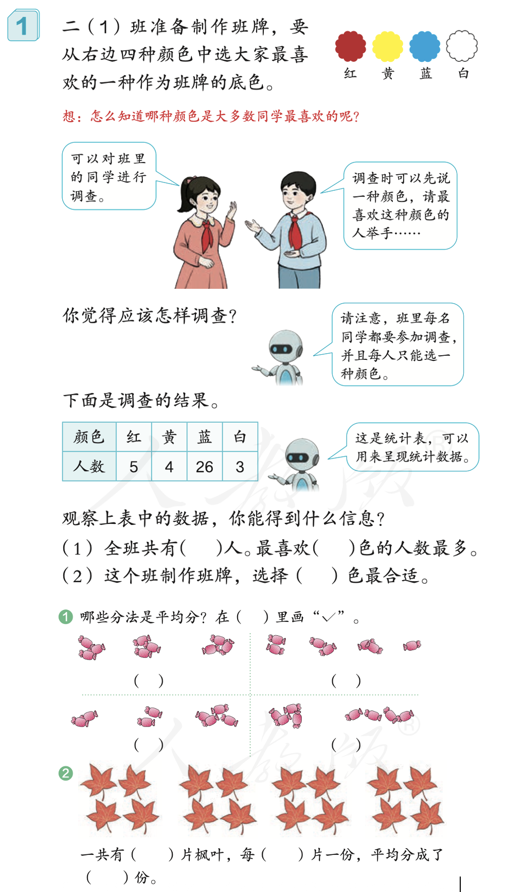
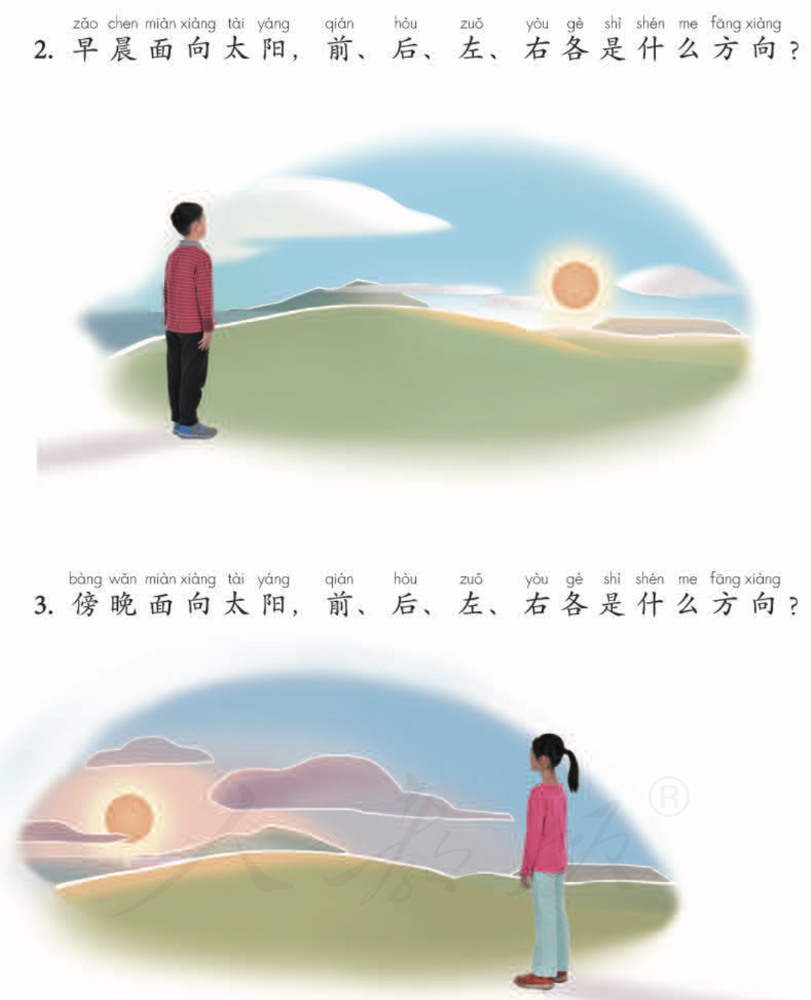
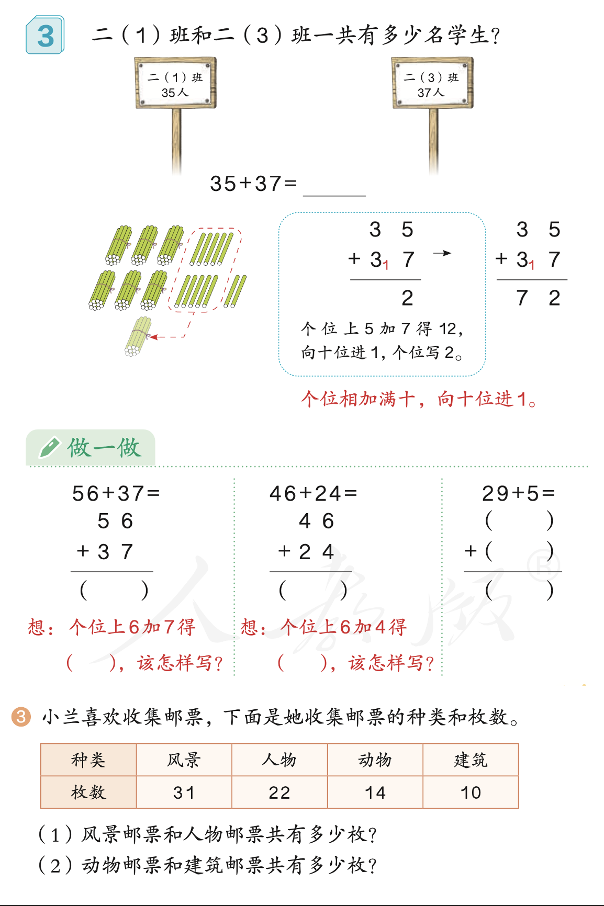
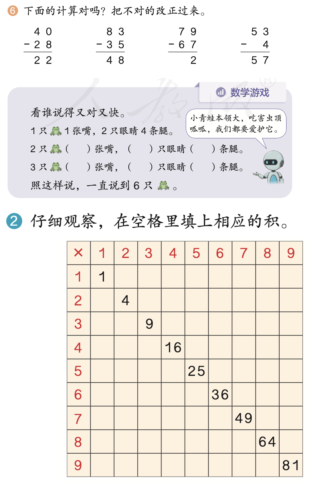

---
tags:
  - NumberSense
  - Logic
  - Apply
  - ZoneOfProximal
date: 2025-11-17
---

# Week 12: Daily Log (Nov 17 - Nov 23)

> 💡 **当前进度**：第12周。重点关注期中前后的知识巩固。

## 📅 Monday (11/17)
### 🏫 School
- [ ] **语文作业**
    - 1️⃣ 读语文书 P60《秋天》5遍
    - 2️⃣ 读语文书 P57 页韵母表5遍，试背。
- [ ] **数学作业**
    - 数学综合练习 (在校已完成)
- [ ] **英语作业**
    - 1️⃣ 读 1A 第44页
    - 2️⃣ 背诵第32页。

### 🏠 Home
- [ ] 
- [ ] 
- [ ] 

## 📅 Tuesday (11/18)
### 🏫 School
- [ ] **语文作业**
    - 1️⃣ 读语文书 P60《秋天》背诵
    - 2️⃣ 完成写字册 P42 页
- [ ] **数学作业**
    - 数学综合练习 (在校已完成)
- [ ] **英语作业**
    - 1️⃣ 读 1A 第45页
    - 2️⃣ 背诵第32页

### 🏠 Home
- [ ] 
- [ ] 

## 📅 Wednesday (11/19)
### 🏫 School
- [ ] **语文作业**
    - 1️⃣ 背诵语文书 P57 页韵母表
    - 2️⃣ 订正默写本（错的每个订三遍），再将韵母表完整抄写两遍。
- [ ] **数学作业**
    - 练习单订正
- [ ] **英语作业**
    - 1️⃣ 读 1A 第47页
    - 2️⃣ 背诵第32页

### 🏠 Home
#### 🧮 Math: Addition & Subtraction
<!-- Generated by: ../../../05-AI-Prompts/math-tutor.md -->

**Goal**: Learn to add Tens with Tens, and Ones with Ones. (学习十位加十位，个位加个位)

**1️⃣ The Sticker Collection (贴纸收集)**
> **Story**: You have 27 star stickers. Your friend gives you 15 more stickers. How many stickers do you have now?
> (题目: $27+15=?$) `#NumberSense` `#Apply` `#ZoneOfProximal`

*   **Step 1: Split the numbers (拆分数字)**
    *   27 is **20** and **7**.
    *   15 is **10** and **5**.
*   **Step 2: Add the Tens (先加十位)**
    *   $20+10= \_\_\_\_$
*   **Step 3: Add the Ones (再加个位)**
    *   $7+5= \_\_\_\_$ (Uh oh, it's more than 10! That is 12)
*   **Step 4: Put them together (最后合起来)**
    *   30 (from Step 2) + 12 (from Step 3) = $\_\_\_\_$

**2️⃣ The Hungry Rabbit (饿肚子的小兔子)**
> **Story**: A rabbit eats 36 carrots in the morning. It eats 25 carrots in the afternoon. How many carrots did it eat in total?
> (题目: $36+25=?$) `#NumberSense` `#Spatial` `#ZoneOfProximal`

*   **Step 1: Stack them up! (竖起来看)**
    *   Let's look at the Ones place first: 6 and 5.
*   **Step 2: Make a Ten (凑个整)**
    *   $6+5= 11$
    *   We keep the 1 in the Ones place.
    *   We send the big 10 to the Tens place (Carry over the 1).
*   **Step 3: Add the Tens (加十位)**
    *   You have 3 and 2.
    *   Don't forget the 1 you carried over!
    *   $3+2+1= 6$ (Child calculated correctly here)
*   **Step 4: Final Answer**
    *   Tens: 6, Ones: 1. The number is: $\_\_\_\_$
    *   *Observation*: Child wrote **16**. (Error: Reversal / Place Value Confusion).
    *   *Action*: Use "Place Value House" drawing to reinforce that Tens live on the Left.

**3️⃣ The Magic Balloons (魔法气球 - 退位减法)**
**Goal**: Learn to "borrow" when the number is too small. (学习当数字不够减时，如何“借位”)

> **Story**: There are 42 balloons in the park. Suddenly, 18 balloons fly away! How many balloons are left?
> (题目: $42-18=?$) `#NumberSense` `#Apply` `#Panic`

*   **Step 1: Look at the Ones (看个位)**
    *   We have 2, and we want to take away 8.
    *   Wait! We can't do $2-8$. 2 is too small! 😱
    *   *Observation*: Child cried and said "It's impossible!".
    *   *Action*: Downgrade to using physical sticks (Enactive Mode).
*   **Step 2: Borrow from a Ten (向十位借一)**
    *   Let's take 1 ten from 40. Now the 40 becomes 30.
    *   Give that 10 to the 2. Now the 2 becomes 12!
*   **Step 3: Subtract the Ones (减个位)**
    *   Now we have 12.
    *   $12-8= \_\_\_\_$
*   **Step 4: Subtract the Tens (减十位)**
    *   Remember, the 4 is now a 3.
    *   $3-1= \_\_\_\_$
*   **Step 5: Final Answer**
    *   Put it together: $\_\_\_\_$

**4️⃣ The Toy Shop (玩具店)**
> **Story**: A toy car costs 53 coins. You pay for a cheaper toy that costs 27 coins. How much cheaper is the second toy?
> (题目: $53-27=?$)

*   **Step 1: Check the Ones (检查个位)**
    *   Can you take 7 away from 3? No! ($3<7$)
*   **Step 2: Knock on the Tens' door (敲敲十位的门)**
    *   "Hello Mr. 50, can I borrow a ten?"
    *   The 5 becomes a 4.
    *   The 3 gets a superpower and becomes 13!
*   **Step 3: Do the math now (现在开始算)**
    *   Ones: $13-7= \_\_\_\_$
    *   Tens: $4-2= \_\_\_\_$
*   **Step 4: What is the number?**
    *   The answer is: $\_\_\_\_$

#### 🧩 Logic Puzzles
<!-- Generated by: ../../../05-AI-Prompts/logic-master.md -->

**Logic Puzzle 1: The Flower Fairies (花仙子的花环)**
*Difficulty*: ⭐⭐⭐ (Deductive Logic / 推理排除)

> **Story**: Three little fairies—Lily, Rose, and Daisy—are going to a party. They each wear a different colored flower crown: Red, Blue, and Yellow.

**Clues (线索)**:
1.  Lily does not wear Red. (Lily 不戴红色。)
2.  Rose wears the color of the sky. (Rose 戴着天空的颜色。)
3.  Daisy does not wear Yellow. (Daisy 不戴黄色。)

**Question**: What color does each fairy wear? `#Logic` `#Analyze` `#ZoneOfProximal`

**Logic Puzzle 2: The Unicorn Race (独角兽赛跑)**
*Difficulty*: ⭐⭐⭐⭐ (Ordering & Comparison / 排序与比较)

> **Story**: Four unicorns are having a running race. Their names are Star, Moon, Cloud, and Sun. Can you find out who came in 1st, 2nd, 3rd, and 4th place? `#Logic` `#Analyze` `#Fluency`

**Clues (线索)**:
1.  Cloud is the fastest. He is Number 1. (Cloud 最快，他是第1名。)
2.  Star is faster than Moon. (Star 比 Moon 快。)
3.  Moon is not the slowest (last). (Moon 不是最慢的/最后一名。)

**Question**: What is the order?
*   *Observation*: Solved in 30 seconds without paper. Too easy.
*   *Action*: Skip similar problems next time.

## 📅 Thursday (11/20) - Today
### 🏫 School
- [ ] (待补充)

### 🏠 Home
#### 🧠 Logic & Math Challenge
<!-- Generated by: ../../../05-AI-Prompts/math-tutor.md -->

**🐰 Ms. Bunny’s Math Challenge 🥕**
Welcome to the Magic Shop! Look at the menu. Can you help Ms. Bunny calculate the bill?

**📋 The Menu (Price List)**
*   🍪 Star Cookie: $3
*   🧁 Cupcake: $5
*   🧪 Magic Potion: $10
*   🧸 Teddy Bear: $15

**Question 1: The Missing Item (Reverse Logic)**
> You bought 1 Teddy Bear 🧸 and 1 Secret Item. The total cost was $25.
> **Question**: What was the Secret Item? Look at the prices!

**Question 2: The Big Sale! (Special Deal)**
> DEAL: "Buy 2 Cookies, Get 1 Free!" (🍪🍪 + 🍪)
> You want to take home 6 Cookies in total.
> **Question**: How much do you have to pay?

**Question 3: The Giant Cake & Small Toy**
> Imagine we have a Giant Cake 🎂 and a Small Toy 🚗.
> *   Together, they cost $20.
> *   The Giant Cake costs $4 more than the Small Toy.
> **Question**: How much is the Giant Cake?
