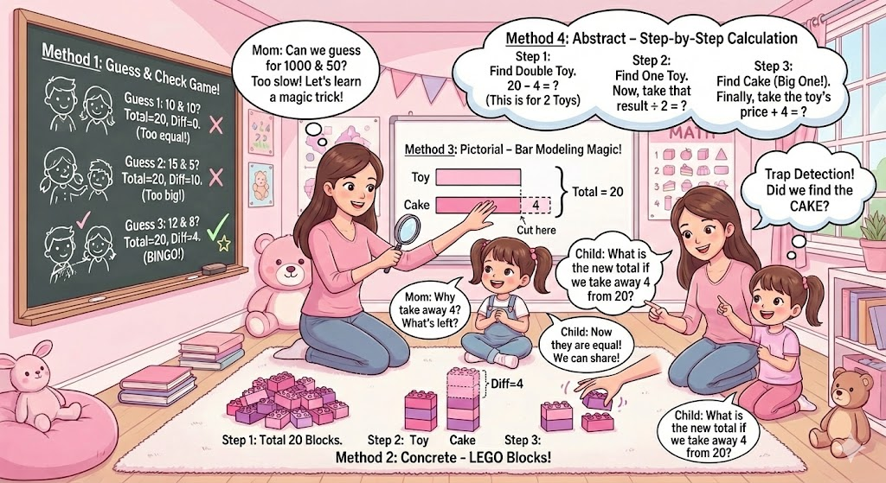

# 📝 Week 12 Review: The "Sum and Difference" Breakthrough

> **Date**: 2025-11-23 (Sunday)
> **Tags**: `#Logic` `#ProblemSolving` `#GrowthMindset`

## 1. Weekly Snapshot (本周概览)
*   **Mood**: 😤 -> 🤩 (Frustrated at first, then proud)
*   **Top Achievement**: Conquered the "Giant Cake" problem using physical tools.
*   **Key Insight**: When abstract numbers fail, go back to concrete objects (Enactive Mode).

---

## 2. 🔬 Case Study: The Giant Cake Problem (深度复盘)

**The Problem**:
> A Giant Cake 🎂 and a Small Toy 🚗 cost **$20** together.
> The Cake costs **$4 more** than the Toy.
> How much is the Cake?

**The Struggle**:
Child tried to guess: "10 and 10? No, that's same price." "14 and 6? Wait..."
Confusion: "How can I split 20 but make one bigger?"

### 💡 The 4 Solution Strategies (四种解题思维)





对于 7 岁的孩子（通常处于皮亚杰认知发展理论中的“前运算阶段”向“具体运算阶段”过渡期），直接套用 $(A+B)/2$ 这种公式是毫无意义的。我们需要利用布鲁纳（Jerome Bruner）的 **CPA 教学法**，即从 **具象 (Concrete)** 到 **图像 (Pictorial)** 再到 **抽象 (Abstract)**，像搭积木一样构建孩子的思维大厦。

这就好比我们要带孩子去爬山，不能直接把他扔到山顶（公式），而是要给他登山杖（工具）和地图（模型），让他自己走上去。

以下是针对这道“巨型蛋糕与小玩具”题目的详细教学方案：

---

### 题目回顾
**问题：** 巨型蛋糕（Giant Cake）和小玩具（Small Toy）一共要 $20。巨型蛋糕比小玩具贵 $4。请问巨型蛋糕多少钱？

---

### 第一阶段：具象化体验 (Concrete)
#### 方法一：实物操作法 (The "Fair Share" Game)
**核心逻辑：** 利用实物消除抽象感，让“差值”看得见摸得着。
**准备工具：** 20 枚硬币（或围棋子、乐高块），两个盘子。

**操作步骤：**
1.  **摆出总数：** 把 20 枚硬币放在桌子中间。
2.  **处理差值：** 告诉孩子：“蛋糕大哥比玩具小弟多 $4，那我们先把这 $4 给蛋糕大哥放在一边，因为这是他‘多出来’的特权。”
3.  **平分剩余：** “剩下的钱，他们两个是不是就一样多了？请你公平地分给他们。”（剩下的 $16 分成 8 和 8）。
4.  **合并计算：** “现在看看蛋糕大哥盘子里一共有多少钱？”

```text
[实物演示示意图]

第一步 (拿出差额):
蛋糕盘: (4)
玩具盘: 
桌上剩: 16

第二步 (平分剩余):
蛋糕盘: (4) + (8)  --> 总共 12
玩具盘:       (8)  --> 总共 8
```

**🧠 元认知引导提问 (家长请问)：**
1.  “如果我们先把蛋糕多出来的 $4 拿走，剩下的钱分给他们俩，这时他们的钱是**相等**的还是**不相等**的？”
2.  “刚才分给蛋糕的那 $8 是他全部的价格吗？还是我们忘了加什么回去？”
3.  “如果蛋糕不比玩具贵，而是和玩具一样便宜，那总共还需要 $20 吗？”

---

### 第二阶段：数感培养 (Transition to Abstract)
#### 方法二：试误法 (Guess and Check)
**核心逻辑：** 培养对数字变化的敏感度。这不是乱猜，而是有策略的调整。

**操作步骤：**
1.  画一个简单的表格。
2.  **引导猜测：** “如果他们俩价钱一样，各是多少？”（10 和 10）。
3.  **检查条件：** “这时候总和是 20，但蛋糕比玩具贵 $4 吗？”（不是，是 0）。
4.  **调整：** “那蛋糕得贵一点，玩具得便宜一点。我们试着从玩具那里拿 $1 给蛋糕。”

```text
[猜想记录表]

| 蛋糕 ($) | 玩具 ($) | 总和 (Target: 20) | 相差 (Target: 4) | 结果 |
| :-----: | :-----: | :--------------: | :-------------: | :--: |
|    10   |    10   |        20        |        0        |  X   |
|    11   |     9   |        20        |        2        |  X   |
|    12   |     8   |        20        |        4        |  √   |
```

**🧠 元认知引导提问 (家长请问)：**
1.  “当你把蛋糕的价格变大时，为了保证总数还是 20，玩具的价格必须发生什么变化？”（代数思维的萌芽：变量间的消长关系）
2.  “第一次我们猜 10 和 10，相差是 0。第二次猜 11 和 9，相差变成了 2。你发现每移动 $1，它们之间的差距会变化多少？”（深度思考：移动 1，差距变 2）
3.  “下一次猜测，你应该把蛋糕变得更贵还是更便宜？”

---

### 第三阶段：图像化建模 (Pictorial) —— **核心重点**
#### 方法三：条形图建模 (Bar Modeling)
**核心逻辑：** 这是新加坡数学的灵魂。通过画长短不一的“条条”，将数量关系视觉化。

**操作步骤：**
1.  **画图：** 鼓励孩子画两条横条。代表蛋糕的条要长，玩具的条要短。
2.  **标记：** 在长出来的部分标上 $4。在两条末端画大括号，标上总数 $20。
3.  **观察：** 遮住多出来的 $4，问孩子看到了什么。

```text
[新加坡数学 Bar Model]

            ? (我们需要求这个)
蛋糕 (Cake): [______________]----$4----|
                                       } 总共 $20
玩具 (Toy):  [______________]          |

(家长动作：用手遮住上面那段 "$4")
剩下的部分:   [______________]
             [______________]  <-- 这两段现在看起来一样长！
```

**解题视觉逻辑：**
$20 - 4 = 16$ (两个相同的短条)
$16 \div 2 = 8$ (一个短条，即玩具的价格)
$8 + 4 = 12$ (蛋糕的价格)

**🧠 元认知引导提问 (家长请问)：**
1.  “看着这个图，如果你用剪刀把蛋糕多出来的这一小段($4)剪掉，现在的‘新总数’还是 20 吗？变成了多少？”
2.  “剪掉之后，剩下的这两条蓝色的条条（Bars），长度有什么关系？”
3.  “我们要找的是长条（蛋糕），既然你知道了短条是 8，怎么变回长条？”

---

### 第四阶段：抽象逻辑与假设 (Abstract)
#### 方法四：逻辑假设法 (Making them Equal)
**核心逻辑：** 这种方法是代数 $2x + 4 = 20$ 的语言化版本，称为“思维实验”。
**适合场景：** 当孩子已经熟练掌握 Bar Model 后，用来提升思维速度。

**思维路径（针对求“大数”的优化）：**
与其把蛋糕切小，不如**把玩具变大**！

1.  **假设：** “想象一下，如果我也给玩具加上 $4 配件，让它变得和蛋糕一样贵，会发生什么？”
2.  **变化：** “现在的总价就不是 20 了，而是 $20 + 4 = 24$。”
3.  **推理：** “现在有两个巨型蛋糕了（因为玩具变得和蛋糕一样了）。”
4.  **计算：** “两个蛋糕是 24，那一个蛋糕是多少？”

```text
[思维实验逻辑图]

原始状态:
蛋糕: [======$$$$] ($4 extra)
玩具: [======]
总价 = 20

思维实验 (把玩具也变成蛋糕):
蛋糕: [======$$$$]
玩具: [======$$$$] <--- 强行加上 $4
新总价 = 20 + 4 = 24

结论:
2 个 蛋糕 = 24
1 个 蛋糕 = 12
```

**🧠 元认知引导提问 (家长请问)：**
1.  “如果我们强行给玩具加价 $4，让它和蛋糕一样贵，那谁（总价）会不高兴并在后面偷偷增加？”
2.  “现在我们有了 $24，这 $24 代表的是两个蛋糕，还是两个玩具？”
3.  “这种方法（加法）算出来直接就是蛋糕的价格，和刚才剪掉的方法（减法）比，你更喜欢哪一种？为什么？”

---

### 给家长的最终建议 (Summary)

1.  **不要急于求成：** 7 岁的孩子可能在“实物操作”阶段停留很久，这完全没问题。只有手摸明白了，脑子才能想明白。
2.  **重视“画图”：** 当孩子遇到更复杂的数字（比如总数 100，差 24）时，实物和猜测法会失效，但 **Bar Model（条形图）** 永远有效。请务必让孩子养成画图的习惯。
3.  **多问“为什么”：** 答案是 $12 并不重要，重要的是孩子能解释清楚“为什么要先减去 4”或者“为什么要加上 4”。
